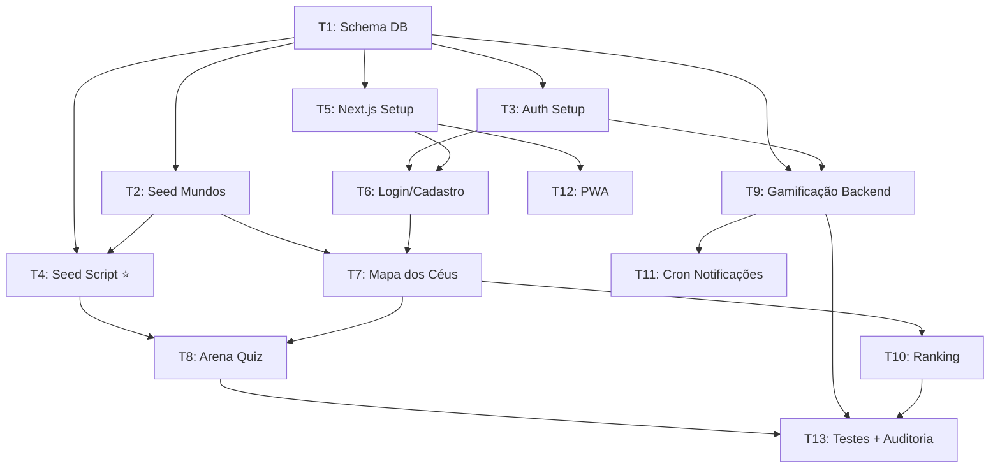

# PLAN — Adaptando MVP (Microlearning Gamificado)

> **Plataforma gamificada de microlearning estilo Duolingo para o Instituto Ádapo.**
> Nivelamento de voluntários sobre o Terceiro Setor e MROSC através de uma trilha de 10 mundos ("Céus").

---

## 1. Visão Geral

| Campo | Detalhe |
|-------|---------|
| **Tipo de Projeto** | WEB (PWA-ready, Mobile-First) |
| **Público** | ~300 voluntários do Instituto Ádapo |
| **Metáfora** | "Dando linha pra sonhar" — O voluntário empina sua pipa através de céus inicialmente conturbados (Mundo 1) até alcançar o "Céu de Brigadeiro" (Mundo 10) |
| **Evolução** | O clima melhora a cada mundo concluído, e o progresso é medido em metros de linha de pipa (XP) |
| **Mundos** | 10 Céus temáticos com progressão visual |

### 🏗️ Decisão Arquitetural: Estratégia de Pré-Cache

> [!IMPORTANT]
> O conteúdo do NotebookLM **NÃO** será consumido em tempo real pelo app.
> Adotamos uma estratégia de **Pré-Cache**: um script de seed lê os notebooks e persiste pílulas + quizzes no Supabase **antes** do app consumir.

**Consequências no design:**
1. O banco precisa de tabelas `pilulas` e `quizzes` com conteúdo pré-populado
2. O frontend consome **somente** do Supabase (nunca do NotebookLM diretamente)
3. O seed script é um processo offline/sob demanda (executado pelo admin)
4. O carregamento do app é **instantâneo** — sem latência de IA

---

## 2. Critérios de Sucesso (MVP)

| Critério | Métrica |
|----------|---------|
| **Carregamento Instantâneo** | Tempo de resposta da API < 200ms (dados pré-cacheados) |
| **Onboarding completo** | Voluntário consegue se cadastrar e iniciar o Mundo 1 em < 2 min |
| **Loop de Gamificação** | XP (metros de linha), vidas, ofensiva e ranking funcionando |
| **Conteúdo populado** | Mínimo 1 pílula + 5 quizzes por mundo via seed script |
| **Mobile-First** | 100% funcional em telas de 360px+ |
| **Custo Zero** | Toda a stack dentro do free tier (Supabase, Vercel) |

---

## 3. Stack Tecnológica

| Camada | Tecnologia | Justificativa |
|--------|-----------|---------------|
| **Frontend** | Next.js 15 (App Router) | SSR/SSG, performance, deploy Vercel (free tier) |
| **Estilização** | Tailwind CSS v4 | Mobile-first utilities, theme system |
| **BaaS** | Supabase | Auth, PostgreSQL, Cron Jobs, RLS — free tier |
| **Seed Script** | Node.js/TypeScript | Integração com NotebookLM MCP → Supabase |
| **Design** | Google Stitch MCP | Prototipação rápida de telas |
| **Deploy** | Vercel | Free tier, integração nativa com Next.js |

---

## 4. Mapeamento NotebookLM → Mundos

| Mundo | Tema (PRD) | Caderno (NotebookLM) | Cor (Módulo) | Clima Visual (Evolução) | Notebook ID |
|-------|-----------|--------------------|-------------|-------------------------|-------------|
| 1 | Voluntariado | Administração | Laranja | 🌩️ Tempestade Escura (Raios e chuva forte) | `a6b34baa-1368-4783-975b-d950b74c17f6` |
| 2 | Pesquisa | Gestão de Projetos | Rosa | 🌧️ Chuva Intensa (Céu cinza escuro, muita água) | `6858b336-bb37-4101-bf57-c2ad45e19661` |
| 3 | Pedagogia | Pedagogia | Amarelo | 🌧️ Garoa Fria (Céu cinza nublado, chuva fina) | `2555025b-586d-430e-ac39-fb2f8ac64edf` |
| 4 | Gestão de Projetos | Gestão de Projetos | Rosa | 🌫️ Névoa Densa (Neblina, visibilidade muito baixa) | `6858b336-bb37-4101-bf57-c2ad45e19661` |
| 5 | Comunicação | Comunicação | Roxo | ☁️ Muito Nublado (Nuvens pesadas, sem sol) | `53b9a1ab-e742-40a9-a14a-cce3aada69b6` |
| 6 | Tecnologia | Tecnologia | Azul Claro | ⛅ Parcialmente Nublado (O sol começa a rasgar as nuvens) | `da8cd8b1-9424-4b34-b7a3-3c500f28cb66` |
| 7 | Indicadores Sociais | Indicadores Sociais | Azul Escuro | 🌤️ Final de Tarde (Sol entre nuvens, vento estabilizando) | `12e270a9-1390-4812-b0db-4bccb877d491` |
| 8 | Captação de Recursos | Captação de Recursos | Verde Claro | 🌤️ Céu Aberto (Azul claro, apenas nuvens esparsas) | `75ecd9e1-3f6c-4cad-bd79-0b43824a4ed4` |
| 9 | Financeiro | Financeiro | Verde Escuro | 🌬️ Brisa Perfeita (Azul vibrante, nuvens limpas, vento ideal) | `c1e1b405-4470-431d-903d-14f399b98877` |
| 10 | Diretoria | Diretoria | Laranja Escuro | 🪁 Céu de Brigadeiro (O cenário perfeito, épico e límpido) | `82753203-e6e1-4a9b-9d7c-fe6c48195b1f` |

> Observação: Os cadernos listados acima são as únicas fontes consideradas para o MVP. O usuário começa preso em uma tempestade conturbada (Mundo 1) e, ao evoluir o conhecimento sobre o Instituto, "desanuvia" o céu visualmente etapa por etapa.

---

## 5. Schema do Banco de Dados (Supabase PostgreSQL)

> Evolução do schema do PRD para suportar a estratégia de Pré-Cache.

### Tabelas Principais

```
voluntarios (from PRD)
├── id: uuid PK (= auth.users.id)
├── nome: text NOT NULL
├── email: text UNIQUE NOT NULL
├── avatar_url: text
├── metros_linha: int DEFAULT 0
├── ofensiva_atual: int DEFAULT 0
├── melhor_ofensiva: int DEFAULT 0
├── vidas_atuais: int DEFAULT 5 (max 5)
├── ultimo_acesso: timestamptz
├── created_at: timestamptz DEFAULT now()
└── updated_at: timestamptz DEFAULT now()

mundo_ceus (from PRD + extended)
├── id: serial PK
├── nome_tema: text NOT NULL
├── clima_visual: text NOT NULL ← Evolução do clima (Tempestade -> Brigadeiro)
├── cor_fase: text NOT NULL     ← Cor visual principal do módulo
├── simbologia: text
├── ordem: int UNIQUE NOT NULL
├── notebook_id: text           ← ID do NotebookLM (para seed)
└── ativo: boolean DEFAULT true

pilulas (NOVO — Pré-Cache)
├── id: uuid PK DEFAULT gen_random_uuid()
├── mundo_id: int FK → mundo_ceus(id)
├── titulo: text NOT NULL
├── conteudo: text NOT NULL      ← Markdown da pílula de leitura
├── ordem: int NOT NULL
├── source_notebook_id: text     ← Rastreabilidade
└── created_at: timestamptz DEFAULT now()

quizzes (NOVO — Pré-Cache)
├── id: uuid PK DEFAULT gen_random_uuid()
├── pilula_id: uuid FK → pilulas(id)
├── pergunta: text NOT NULL
├── alternativas: jsonb NOT NULL ← [{texto, correta: bool}]
├── explicacao: text             ← Feedback ao errar
├── ordem: int NOT NULL
├── dificuldade: enum('facil','medio','dificil') DEFAULT 'medio'
└── created_at: timestamptz DEFAULT now()

progresso (from PRD + extended)
├── id: uuid PK DEFAULT gen_random_uuid()
├── voluntario_id: uuid FK → voluntarios(id)
├── mundo_id: int FK → mundo_ceus(id)
├── status: enum('bloqueado','ativo','concluido') DEFAULT 'bloqueado'
├── pontuacao_local: int DEFAULT 0
├── pilula_atual: int DEFAULT 1
└── UNIQUE(voluntario_id, mundo_id)

respostas_quiz (NOVO — histórico)
├── id: uuid PK DEFAULT gen_random_uuid()
├── voluntario_id: uuid FK → voluntarios(id)
├── quiz_id: uuid FK → quizzes(id)
├── resposta_idx: int NOT NULL
├── acertou: boolean NOT NULL
├── respondido_em: timestamptz DEFAULT now()
└── UNIQUE(voluntario_id, quiz_id)
```

### RLS (Row Level Security)
- `voluntarios`: usuário lê/edita somente seu próprio registro
- `progresso` / `respostas_quiz`: usuário lê/escreve somente seus dados
- `mundo_ceus` / `pilulas` / `quizzes`: leitura pública (conteúdo)
- Ranking: policy especial para leitura de `metros_linha` de todos

---

## 6. Estrutura de Diretórios

```
adaptando/
├── docs/
│   └── PLAN-adaptando.md          ← ESTE ARQUIVO
├── arquitetura/
│   └── adaptando-PRD.md           ← PRD original
├── scripts/
│   └── seed/
│       ├── seed-from-notebooklm.ts  ← Script de Seed (NotebookLM → Supabase)
│       └── README.md
├── src/
│   ├── app/
│   │   ├── layout.tsx
│   │   ├── page.tsx               ← Landing/Login
│   │   ├── (auth)/
│   │   │   ├── login/page.tsx
│   │   │   └── cadastro/page.tsx
│   │   ├── (app)/
│   │   │   ├── layout.tsx         ← Shell autenticado (topbar)
│   │   │   ├── mapa/page.tsx      ← Dashboard (O Mapa dos Céus)
│   │   │   ├── arena/
│   │   │   │   └── [mundoId]/page.tsx  ← Arena de Quiz
│   │   │   └── ranking/page.tsx
│   │   └── globals.css
│   ├── components/
│   │   ├── ui/                    ← Componentes base (Button, Card, etc.)
│   │   ├── gamification/
│   │   │   ├── HeartCounter.tsx
│   │   │   ├── StreakFire.tsx
│   │   │   ├── XPMeter.tsx
│   │   │   └── RankingCard.tsx
│   │   ├── quiz/
│   │   │   ├── PillCard.tsx       ← Pílula de leitura
│   │   │   ├── QuizQuestion.tsx
│   │   │   └── QuizFeedback.tsx
│   │   └── map/
│   │       ├── SkyWorld.tsx       ← Nó do mundo no mapa
│   │       └── KiteAvatar.tsx     ← Pipa do usuário
│   ├── lib/
│   │   ├── supabase/
│   │   │   ├── client.ts
│   │   │   ├── server.ts
│   │   │   └── middleware.ts
│   │   ├── gamification.ts        ← Lógica de XP, vidas, ofensiva
│   │   └── types.ts               ← Tipos TS gerados do Supabase
│   └── hooks/
│       ├── useVoluntario.ts
│       ├── useProgresso.ts
│       └── useQuiz.ts
├── supabase/
│   └── migrations/                ← Migrations gerenciadas via MCP
├── public/
│   └── images/                    ← Assets dos céus, pipa, etc.
├── .env.local.example
├── next.config.ts
├── tailwind.config.ts
├── package.json
└── tsconfig.json
```

---

## 7. Task Breakdown

### Fase P0 — Fundação (Database + Auth)

#### T1: Schema do Banco de Dados
- **Agent**: `database-architect`
- **Skill**: `database-design`
- **Prioridade**: P0 (bloqueante)
- **INPUT**: Schema definido na Seção 5 deste plano
- **OUTPUT**: Migrations aplicadas no Supabase via MCP + RLS configurado
- **VERIFY**: `list_tables` retorna todas as tabelas com colunas corretas; RLS ativo
- [ ] Criar tabelas `voluntarios`, `mundo_ceus`, `pilulas`, `quizzes`, `progresso`, `respostas_quiz`
- [ ] Configurar enums (`status_progresso`, `dificuldade_quiz`)
- [ ] Aplicar RLS policies
- [ ] Gerar tipos TypeScript via MCP

#### T2: Seed dos Mundos (Dados Estáticos)
- **Agent**: `database-architect`
- **Skill**: `database-design`
- **Prioridade**: P0
- **Depende de**: T1
- **INPUT**: Tabela de mundos da Seção 4 (com cores visuais)
- **OUTPUT**: 10 registros em `mundo_ceus` com `notebook_id` e `cor_fase` mapeados
- **VERIFY**: `SELECT * FROM mundo_ceus ORDER BY ordem` retorna 10 linhas

#### T3: Configuração do Supabase Auth
- **Agent**: `security-auditor`
- **Skill**: `clean-code`
- **Prioridade**: P0
- **Depende de**: T1
- **INPUT**: Requisitos do PRD (Magic Link ou Email/Senha)
- **OUTPUT**: Auth configurado com email+senha, trigger para criar perfil em `voluntarios`
- **VERIFY**: Criar usuário via Auth → registro aparece em `voluntarios`

---

### Fase P0.5 — Seed Script (NotebookLM → Supabase)

#### T4: Script de Seed (Pré-Cache do Conteúdo) ⭐
- **Agent**: `backend-specialist`
- **Skill**: `clean-code`, `nodejs-best-practices`
- **Prioridade**: P0 (crítico para conteúdo)
- **Depende de**: T1, T2
- **INPUT**: IDs dos notebooks (Seção 4) + MCP do NotebookLM
- **OUTPUT**: Script `scripts/seed/seed-from-notebooklm.ts` que:
  1. Para cada mundo, consulta o notebook correspondente via `notebook_query`
  2. Pede ao NotebookLM: "Gere 1 pílula de leitura curta (3-5 parágrafos) sobre [tema]"
  3. Pede ao NotebookLM: "Gere 5 perguntas de quiz de múltipla escolha com 4 alternativas sobre [tema]"
  4. Parse a resposta e insere em `pilulas` e `quizzes` no Supabase
  5. Loga progresso e erros
- **VERIFY**: Após rodar, `SELECT count(*) FROM pilulas` >= 10, `SELECT count(*) FROM quizzes` >= 50
- [ ] Criar estrutura `scripts/seed/`
- [ ] Implementar conexão com NotebookLM via MCP tools
- [ ] Implementar parser de resposta (pílula + quizzes)
- [ ] Implementar inserção no Supabase via client
- [ ] Documentar em `scripts/seed/README.md`

---

### Fase P1 — Frontend Scaffold

#### T5: Setup do Projeto Next.js
- **Agent**: `frontend-specialist`
- **Skill**: `nextjs-react-expert`, `tailwind-patterns`
- **Prioridade**: P1
- **Depende de**: T1 (para tipos TS)
- **INPUT**: Stack definida (Next.js 15, Tailwind v4)
- **OUTPUT**: Projeto inicializado com layout base, theme tokens, Supabase client
- **VERIFY**: `npm run dev` abre sem erros; `npm run build` sucesso
- [ ] `npx create-next-app` com App Router + TypeScript
- [ ] Configurar Tailwind com tokens de cor dos Céus
- [ ] Configurar Supabase client (server + client)
- [ ] Layout raiz com metadata SEO

#### T6: Autenticação (Login/Cadastro)
- **Agent**: `frontend-specialist`
- **Skill**: `nextjs-react-expert`
- **Prioridade**: P1
- **Depende de**: T3, T5
- **INPUT**: Supabase Auth configurado
- **OUTPUT**: Páginas `/login` e `/cadastro` funcionais, middleware de proteção
- **VERIFY**: Cadastrar → logar → acessar `/mapa`; acessar `/mapa` sem auth → redireciona
- [ ] Página de Login (email/senha)
- [ ] Página de Cadastro
- [ ] Middleware de proteção de rotas
- [ ] Redirecionamentos pós-auth

---

### Fase P2 — Core Features (UI + Gamificação)

#### T7: Dashboard — O Mapa dos Céus
- **Agent**: `frontend-specialist`
- **Skill**: `frontend-design`, `nextjs-react-expert`
- **Prioridade**: P2
- **Depende de**: T2, T6
- **INPUT**: Dados de `mundo_ceus` + `progresso` do voluntário
- **OUTPUT**: Mapa vertical com 10 mundos (e suas respectivas cores), pipa do usuário, estados (bloqueado/ativo/concluído)
- **VERIFY**: Mundos renderizados; mundo 1 ativo; demais bloqueados para novo usuário
- [ ] Componente `SkyWorld` (visual de cada céu, com prop de cor)
- [ ] Componente `KiteAvatar` (pipa no nível atual)
- [ ] Topbar com `HeartCounter`, `StreakFire`, `XPMeter`
- [ ] Fetch server-side dos dados

#### T8: Arena de Quiz
- **Agent**: `frontend-specialist`
- **Skill**: `frontend-design`, `nextjs-react-expert`
- **Prioridade**: P2
- **Depende de**: T4, T7
- **INPUT**: Dados de `pilulas` + `quizzes` para o mundo ativo
- **OUTPUT**: Fluxo: Pílula → Quiz 1 ao 5 → Resultado
- **VERIFY**: Ler pílula → responder 5 quizzes → ver feedback de acerto/erro → XP atualizada
- [ ] Componente `PillCard` (pílula de leitura)
- [ ] Componente `QuizQuestion` (múltipla escolha)
- [ ] Componente `QuizFeedback` (verde/vermelho + explicação)
- [ ] Lógica de fluxo (step-by-step)

#### T9: Lógica de Gamificação (Backend)
- **Agent**: `backend-specialist`
- **Skill**: `clean-code`
- **Prioridade**: P2
- **Depende de**: T1, T3
- **INPUT**: Regras de gamificação do PRD (Seção 4.2)
- **OUTPUT**: Funções Supabase (ou edge functions) para:
  - Registrar resposta de quiz → atualizar XP (`metros_linha`)
  - Perder vida ao errar → decrementar `vidas_atuais` (min 0)
  - Restaurar vidas por tempo (1 vida / 30min, max 5)
  - Atualizar ofensiva diária (`ofensiva_atual`)
  - Desbloquear próximo mundo ao concluir o atual
- **VERIFY**: Quiz acertado → XP sobe; errado → vida desce; ofensiva incrementa ao logar no dia
- [ ] Função `registrar_resposta`
- [ ] Função `atualizar_ofensiva`
- [ ] Função `restaurar_vidas` (Cron Job ou cálculo on-read)
- [ ] Função `desbloquear_mundo`

#### T10: Tela de Ranking
- **Agent**: `frontend-specialist`
- **Skill**: `frontend-design`
- **Prioridade**: P2
- **Depende de**: T7
- **INPUT**: `voluntarios` ordenados por `metros_linha` DESC
- **OUTPUT**: Página `/ranking` com top 3 destacados + lista completa
- **VERIFY**: Ranking renderiza corretamente; top 3 com visual diferenciado
- [ ] Query ordenada com limite
- [ ] Top 3 com destaque visual (pódio)
- [ ] Lista do 4º em diante

---

### Fase P3 — Retenção e Polish

#### T11: Notificações de Retenção (Cron Job)
- **Agent**: `backend-specialist`
- **Skill**: `clean-code`
- **Prioridade**: P3
- **Depende de**: T9
- **INPUT**: Regra da Seção 7 do PRD (cron às 18h)
- **OUTPUT**: Cron Job no Supabase que verifica ofensiva e envia email via Resend
- **VERIFY**: Simular `ultimo_acesso` antigo → cron detecta → email enviado
- [ ] Configurar Edge Function para cron
- [ ] Lógica de detecção de ofensiva em risco
- [ ] Integração com Resend (ou Supabase email)

#### T12: PWA + Otimizações Mobile
- **Agent**: `frontend-specialist`
- **Skill**: `performance-profiling`, `nextjs-react-expert`
- **Prioridade**: P3
- **Depende de**: T5
- **INPUT**: Requisito mobile-first
- **OUTPUT**: manifest.json, service worker, ícones, meta tags
- **VERIFY**: "Adicionar à tela inicial" funciona no Chrome Android; Lighthouse PWA > 80
- [ ] Web manifest
- [ ] Meta tags viewport/theme-color
- [ ] Ícones em múltiplos tamanhos
- [ ] Otimização de fontes e imagens

---

### Fase X — Verificação Final

#### T13: Testes + Auditoria
- **Agent**: `test-engineer`, `security-auditor`
- **Skill**: `testing-patterns`, `vulnerability-scanner`
- **Prioridade**: PX
- **Depende de**: Todas as tarefas anteriores
- [ ] Testes unitários para lógica de gamificação
- [ ] Testes E2E do fluxo completo (cadastro → quiz → ranking)
- [ ] Security scan (RLS, auth, secrets)
- [ ] Lighthouse audit (performance, accessibility, SEO)
- [ ] Build de produção sem erros

---

## 8. User Stories (Product Manager — Validadas)

### US-01: Cadastro Rápido (MUST)
> Como **voluntário**, quero me **cadastrar com email e senha**, para **começar a aprender imediatamente**.

**AC:**
- Given que estou na página de cadastro
- When preencho nome, email e senha e clico em "Começar"
- Then minha conta é criada, sou redirecionado ao Mapa, e o Mundo 1 está desbloqueado
- **Perf**: Tempo de login → dashboard < 2s (dados pré-cacheados)

### US-02: Mapa dos Céus (MUST)
> Como **voluntário logado**, quero ver **minha posição na trilha de mundos**, para saber meu **progresso e próximo desafio**.

**AC:**
- Given que estou logado
- When acesso o Dashboard
- Then vejo 10 mundos com suas devidas cores em ordem vertical, meu mundo ativo destacado, e os demais bloqueados/concluídos
- **Perf**: Renderização do mapa < 200ms (query única no Supabase)

### US-03: Aprender com Pílulas (MUST)
> Como **voluntário**, quero **ler uma pílula curta** antes do quiz, para **absorver o conteúdo antes de ser testado**.

**AC:**
- Given que entrei em um mundo ativo
- When a arena abre
- Then vejo primeiro uma pílula de leitura (3-5 parágrafos) carregada **instantaneamente** do banco
- **Perf**: Tempo de carregamento da pílula < 100ms (pré-cache, sem chamada a IA)

### US-04: Responder Quizzes (MUST)
> Como **voluntário**, quero **responder 5 perguntas** sobre o conteúdo, para **ganhar metros de linha**.

**AC:**
- Given que li a pílula
- When respondo cada pergunta
- Then vejo feedback imediato (verde/vermelho), ganho XP ao acertar, perco vida ao errar
- **Perf**: Feedback de resposta < 50ms (operação local + write async no banco)

### US-05: Gamificação Visível (MUST)
> Como **voluntário**, quero ver **minhas vidas, ofensiva e XP** sempre visíveis, para me **sentir motivado**.

**AC:**
- Given qualquer tela autenticada
- When olho a topbar
- Then vejo corações (vidas), chama (ofensiva em dias), e metros de linha (XP total)

### US-06: Ranking (SHOULD)
> Como **voluntário**, quero ver **como estou em relação aos colegas**, para ter **motivação competitiva**.

**AC:**
- Given que acesso o Ranking
- When a página carrega
- Then vejo o top 3 em destaque e minha posição na lista geral

### US-07: Notificação de Ofensiva (SHOULD)
> Como **voluntário com ofensiva ativa**, quero ser **notificado às 18h se ainda não acessei**, para **não perder minha sequência**.

**AC:**
- Given que tenho ofensiva > 0 e não acessei hoje
- When são 18h
- Then recebo email: "Sua pipa está caindo! Salve sua ofensiva de X dias."

### US-08: Seed de Conteúdo (MUST — Admin)
> Como **administrador**, quero **rodar o seed script** para **popular o banco com conteúdo do NotebookLM**.

**AC:**
- Given que tenho acesso ao terminal e as credenciais do NotebookLM estão autenticadas
- When executo `npx tsx scripts/seed/seed-from-notebooklm.ts`
- Then cada mundo recebe pelo menos 1 pílula e 5 quizzes no Supabase
- **Perf**: Seed completo em < 15min para 10 mundos

---

## 9. Diagrama de Dependências



---

## 10. Riscos e Mitigações

| Risco | Impacto | Mitigação |
|-------|---------|-----------|
| NotebookLM rate limit no seed | seed falha ou fica lento | Throttle + retry com backoff; rodar mundo a mundo |
| NotebookLM retorna formato inesperado | quizzes mal formatados | Parser robusto + validação + fallback para mock |
| Conteúdo insuficiente nos notebooks | mundos com pílulas/quizzes pobres | Enriquecer notebooks antes do seed; fallback para conteúdo manual |
| Supabase free tier limits | 500MB DB, 50K auth | Suficiente para 300 voluntários; revisar se escalar |

---

*Gerado em 21/03/2026 por `@orchestrator` + `@product-manager` + `@project-planner`.*
*Aguardando aprovação do usuário para prosseguir para SOLUTIONING → IMPLEMENTATION.*
